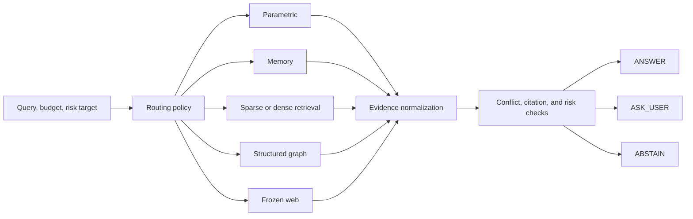

# EvidRoute

[](https://github.com/pxnkit/evidroute/actions/workflows/ci.yml)
[](https://www.python.org/)
[](https://react.dev/)
[](LICENSE)

EvidRoute is an offline-first research implementation of risk-constrained sequential evidence
routing. Given a query, resource budget, and risk target, the policy selects among heterogeneous
evidence sources or terminates with `ANSWER`, `ASK_USER`, or `ABSTAIN`.

The system provides typed route contracts, evidence normalization, citation tracking,
counterfactual route evaluation, selective-risk calibration, source-shift detection, and
replayable decision traces. The reference configuration is deterministic, CPU-compatible, and
does not require external credentials.

| Item | Status |
| --- | --- |
| Release | `0.1.0` research prototype |
| Reference evaluation | Synthetic MiniRoute benchmark |
| Public benchmark evaluation | Not yet executed |
| Default network policy | Offline |
| API | FastAPI |
| User interface | React and TypeScript |
| License | MIT |

## System model

At each decision step, the router observes the query, remaining budget, source health, prior
evidence, and configured risk target. It selects a feasible evidence route or a terminal action.
Each acquisition returns a normalized evidence bundle with provenance, cost, latency, and typed
failure information.



The decision loop is bounded by configurable limits on route calls, cost, latency, and retrieval
hops. A route is selected only when its estimated value exceeds its acquisition cost and the
resulting decision satisfies the applicable risk policy.

## Evidence routes

| Route | Implementation | Default |
| --- | --- | --- |
| `PARAMETRIC` | Deterministic model-knowledge fixture | Enabled |
| `EPISODIC_MEMORY` | Local user-specific memory with staleness metadata | Enabled |
| `BM25` | Sparse retrieval from corpus statistics | Enabled |
| `DENSE` | Deterministic signed feature hashing for semantic retrieval | Enabled |
| `STRUCTURED` | Bounded graph traversal with document provenance | Enabled |
| `FROZEN_WEB` | Versioned web-style snapshots for temporal evaluation | Enabled |
| `LIVE_WEB` | External retrieval interface | Disabled |

All routes implement the same operations:

```text
availability -> estimate -> probe -> acquire -> health -> close
```

Failures such as timeout, privacy denial, unavailable source, malformed result, and empty result
remain explicit in the trace.

## Quick start

### Docker Compose

```bash
git clone https://github.com/pxnkit/evidroute.git
cd evidroute
docker compose up --build
```

| Service | Address |
| --- | --- |
| Research console | [http://localhost:8080](http://localhost:8080) |
| OpenAPI documentation | [http://localhost:8000/docs](http://localhost:8000/docs) |
| Health endpoint | [http://localhost:8000/healthz](http://localhost:8000/healthz) |

Reference query:

```text
According to the latest snapshot, where will Aurora launch?
```

Expected deterministic result:

```text
Selected route: FROZEN_WEB
Answer: Zurich
Citation: frozen_web:web_port_t1
```

The example uses fictional MiniRoute data and does not represent a real-world factual claim.

Stop the services with:

```bash
docker compose down
```

## Development setup

Required versions:

- Python 3.12
- Node.js 22
- pnpm 11.9

### Windows PowerShell

```powershell
./scripts/setup.ps1
```

Start the API:

```powershell
.\.venv\Scripts\python.exe -m uvicorn evidroute.api:app --reload --port 8000
```

Start the web application in a second terminal:

```powershell
Set-Location apps/web
pnpm dev
```

### POSIX or WSL

```bash
make setup
python -m uvicorn evidroute.api:app --reload --port 8000
```

Start the web application in a second terminal:

```bash
cd apps/web
pnpm dev
```

The development server is available at [http://localhost:5173](http://localhost:5173).

## API surface

| Method | Endpoint | Purpose |
| --- | --- | --- |
| `GET` | `/healthz` | Service health |
| `GET` | `/v1/routes` | Route capabilities and availability |
| `GET` | `/v1/source-health` | Current source-health state |
| `POST` | `/v1/query` | Execute the sequential routing policy |
| `POST` | `/v1/route-preview` | Inspect candidates without acquisition |
| `POST` | `/v1/feedback` | Record decision feedback |
| `GET` | `/v1/traces/{trace_id}` | Retrieve a decision trace |
| `GET` | `/v1/traces/{trace_id}/export` | Export a canonical JSON trace |
| `POST` | `/v1/corpora` | Register a validated local corpus |
| `POST` | `/v1/snapshots/activate` | Select a frozen source snapshot |
| `POST` | `/v1/recalibrate` | Refit the selective-risk controller |
| `GET` | `/v1/models` | List model metadata |
| `GET` | `/v1/config` | Read the active public configuration |

Request and response schemas are available through the OpenAPI interface.

## Evaluation and reproducibility

MiniRoute is a synthetic benchmark included with the repository. Its cases cover direct lookup,
lexical and semantic retrieval, structured reasoning, temporal updates, stale memory,
contradictory sources, ambiguity, privacy constraints, prompt injection, source outages, and
distribution shift.

Run the complete reference experiment:

```bash
python -m evidroute.cli reproduce-mini --output artifacts/reproduce-mini
```

The command performs the following operations:

1. rebuilds deterministic retrieval indices;
2. generates forced-route potential outcomes;
3. trains the CPU potential-outcome router;
4. calibrates the selective-risk controller;
5. evaluates fixed and adaptive routing policies;
6. runs deterministic source-shift scenarios; and
7. generates Markdown, CSV, JSON, and SVG artifacts.

The committed smoke report validates system integration and artifact generation. It is not a
claim of performance on external datasets.

## Validation

GitHub Actions applies the following checks to every push and pull request:

| Backend | Frontend | Containers |
| --- | --- | --- |
| Ruff | ESLint | API image build |
| Strict mypy | TypeScript compiler | Web image build |
| Pytest | Vitest | Read-only runtime configuration |
| Branch coverage threshold of 75% | Production Vite build | Health checks |
| Deterministic smoke experiment | Frozen pnpm lockfile | Dropped Linux capabilities |

Current workflow status is available in
[GitHub Actions](https://github.com/pxnkit/evidroute/actions/workflows/ci.yml).

## Repository layout

| Path | Contents |
| --- | --- |
| [`apps/api`](apps/api) | FastAPI entry point |
| [`apps/web`](apps/web) | React, TypeScript, and Vite application |
| [`src/evidroute`](src/evidroute) | Core routing, evidence, risk, evaluation, security, and tracing packages |
| [`data/mini_route`](data/mini_route) | Synthetic benchmark fixtures |
| [`configs`](configs) | Experiment, router, shift, and paper configurations |
| [`scripts`](scripts) | Setup, validation, evaluation, and artifact commands |
| [`tests`](tests) | Unit, integration, failure-injection, security, and API tests |
| [`paper`](paper) | LaTeX manuscript scaffold and generated assets |
| [`reports`](reports) | Model card, data statement, ethics report, scope ledger, and smoke results |

## Research context

The design is informed by research directions presented in ACL 2025, EMNLP 2025, NeurIPS 2025,
and ICML 2026 manuscripts on uncertainty-aware retrieval, search control, information foraging,
and conversational agents over unstructured knowledge.

EvidRoute is an original implementation. It is not an official reproduction and does not reuse
source code, private data, or reported experimental results from those works. The detailed
relationship to prior work is documented in
[`docs/related-work.md`](docs/related-work.md) and [`paper/references.bib`](paper/references.bib).

## Limitations

- MiniRoute is synthetic, small, and intended for integration testing.
- The parametric route is a deterministic fixture rather than a production language model.
- Live web retrieval is disabled in the reference configuration.
- Calibration guarantees are invalidated when source shift is detected.
- Public benchmark experiments in [`configs/paper`](configs/paper) remain unrun.
- The repository is a research prototype and has not been qualified for production use.

## Data and security

The reference experiment operates entirely on redistributable synthetic data. The optional
τ-Knowledge adapter accepts a user-provided private archive path at runtime. Private documents,
tasks, policies, traces, archives, and generated checkpoints are excluded from version control,
Docker images, CI, and public artifacts.

Relevant documents:

- [`reports/data_statement.md`](reports/data_statement.md)
- [`docs/threat-model.md`](docs/threat-model.md)
- [`reports/ethics.md`](reports/ethics.md)

## Documentation

| Document | Scope |
| --- | --- |
| [`docs/architecture.md`](docs/architecture.md) | Components, data flow, and invariants |
| [`docs/routes.md`](docs/routes.md) | Route contracts and selection rules |
| [`docs/reproducibility.md`](docs/reproducibility.md) | Deterministic experiment procedure |
| [`docs/threat-model.md`](docs/threat-model.md) | Trust boundaries and mitigations |
| [`docs/related-work.md`](docs/related-work.md) | Research context and differentiation |
| [`reports/model_card.md`](reports/model_card.md) | Router behavior and limitations |
| [`reports/data_statement.md`](reports/data_statement.md) | Dataset composition and handling |
| [`reports/research_scope.md`](reports/research_scope.md) | Implemented, partial, and unrun claims |

## Contributing

Contribution requirements are defined in [`CONTRIBUTING.md`](CONTRIBUTING.md). Substantive
changes should preserve route typing, deterministic failure behavior, trace completeness, and
the distinction between executed and proposed experiments.

## Citation

Citation metadata is provided in [`CITATION.cff`](CITATION.cff). Publications that discuss the
underlying research directions should cite the original manuscripts separately.

## License

EvidRoute is distributed under the [MIT License](LICENSE).
