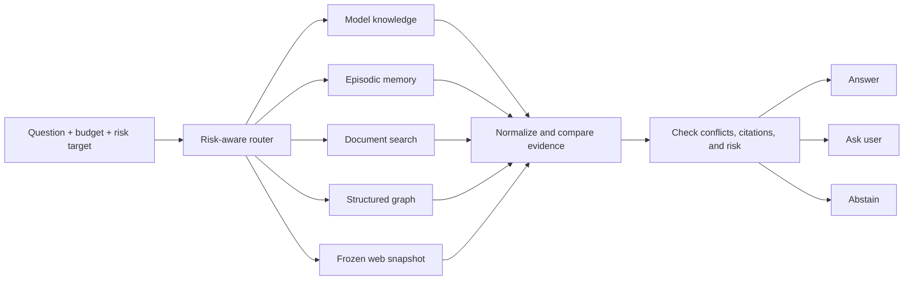

# EvidRoute

[](https://github.com/pxnkit/evidroute/actions/workflows/ci.yml)
[](https://www.python.org/)
[](https://react.dev/)
[](LICENSE)

> An auditable research testbed that decides where an AI agent should look next—and when it
> should stop.

EvidRoute routes a question across different evidence sources while respecting cost, latency,
privacy, and answer-risk limits. It can search local documents, inspect memory, traverse
structured data, use a frozen web snapshot, ask for clarification, or abstain when the evidence
is not strong enough.

The default demo is fully offline, deterministic, and credential-free.

| Project status | Engineering prototype and reproducibility scaffold |
| --- | --- |
| Default mode | Offline; no API keys or external services required |
| Interface | React research console + FastAPI |
| Evaluation | Bundled synthetic MiniRoute benchmark |
| Current claim | The complete pipeline runs end to end; public benchmark results remain unrun |

## Why EvidRoute?

Most retrieval systems make one decision: **search or do not search**. Real agents face a
harder problem:

- Which source is most useful for this question?
- Is that source available, current, private, or potentially unsafe?
- Is another retrieval step worth its cost?
- Is the evidence reliable enough to answer?
- Should the system ask the user or abstain instead?

EvidRoute makes those choices explicit, typed, budgeted, and replayable.

## How it works



For every query, the system:

1. probes the available evidence routes;
2. estimates utility, cost, latency, and answer risk;
3. acquires the most useful feasible evidence;
4. normalizes citations and detects conflicts;
5. answers only when the configured risk target is satisfied; and
6. records the complete decision trace for inspection or replay.

## Run it in 60 seconds

### Docker Compose (recommended)

Requirements: Docker with Compose support.

```bash
git clone https://github.com/pxnkit/evidroute.git
cd evidroute
docker compose up --build
```

Open:

- Research console: [http://localhost:8080](http://localhost:8080)
- API documentation: [http://localhost:8000/docs](http://localhost:8000/docs)
- API health check: [http://localhost:8000/healthz](http://localhost:8000/healthz)

Try this bundled example in the console:

```text
According to the latest snapshot, where will Aurora launch?
```

The router selects the frozen-web route, returns `Zurich`, and cites the matching 2026 snapshot.
The example is fictional and deterministic; it demonstrates the routing pipeline rather than
real-world knowledge.

Stop the stack with:

```bash
docker compose down
```

## Local development

Requirements: Python 3.12, Node.js 22, and pnpm 11.9.

### Windows PowerShell

```powershell
./scripts/setup.ps1
```

Start the API:

```powershell
.\.venv\Scripts\python.exe -m uvicorn evidroute.api:app --reload --port 8000
```

In a second terminal, start the web application:

```powershell
Set-Location apps/web
pnpm dev
```

The development UI is available at [http://localhost:5173](http://localhost:5173).

### POSIX / WSL

```bash
make setup
python -m uvicorn evidroute.api:app --reload --port 8000
```

In a second terminal:

```bash
cd apps/web
pnpm dev
```

## What is included

| Area | Implementation |
| --- | --- |
| Routing | One-shot and bounded sequential policies with budget and value-of-information checks |
| Evidence | Seven typed adapters with availability, cost, health, and failure contracts |
| Safety | Citation verification, conflict detection, upload guardrails, privacy classes, and abstention |
| Risk | One-sided selective-risk bounds, calibration, source-shift detection, and safe fallback |
| Evaluation | Forced-route outcomes, oracle labels, route regret, seeded shifts, and reproducible reports |
| Observability | SQLite traces, reason codes, source versions, configuration hashes, and JSON export |
| Applications | FastAPI service and responsive React/TypeScript research console |
| Delivery | Docker Compose, GitHub Actions, tests, model card, data statement, and paper scaffold |

## Evidence routes

| Route | Best suited for | Default demo |
| --- | --- | --- |
| `PARAMETRIC` | Questions answerable from the deterministic model fixture | Enabled |
| `EPISODIC_MEMORY` | User-specific facts stored in local memory | Enabled |
| `BM25` | Exact terms and lexical matches | Enabled |
| `DENSE` | Semantic similarity without exact keyword overlap | Enabled |
| `STRUCTURED` | Bounded traversal over linked entities and relations | Enabled |
| `FROZEN_WEB` | Time-versioned, reproducible web-style evidence | Enabled |
| `LIVE_WEB` | Current external information through a future adapter | Disabled |

All routes return the same normalized evidence contract, so the policy can compare them without
hiding failures or source-specific behavior.

## Reproduce MiniRoute

MiniRoute is the small synthetic benchmark bundled with the repository. It covers direct lookup,
multi-source reasoning, temporal updates, stale memory, contradictions, ambiguity, privacy
constraints, prompt injection, outages, and source shift.

```bash
python -m evidroute.cli reproduce-mini --output artifacts/reproduce-mini
```

This command rebuilds deterministic indices, generates forced-route outcomes, trains the
CPU-friendly router, calibrates the risk controller, evaluates fixed and adaptive policies,
runs the shift suite, and creates Markdown, CSV, and SVG report assets.

The committed smoke result validates integration only. It is not evidence that EvidRoute
outperforms published systems.

## Quality gates

Every push and pull request runs:

| Backend | Frontend | Containers |
| --- | --- | --- |
| Ruff linting | ESLint | API image build |
| Strict mypy | TypeScript checking | Web image build |
| Pytest with branch coverage ≥ 75% | Vitest | Minimal runtime images |
| Deterministic smoke experiment | Production Vite build | Read-only runtime hardening |

See the latest result in [GitHub Actions](https://github.com/pxnkit/evidroute/actions/workflows/ci.yml).

## Repository structure

| Path | Purpose |
| --- | --- |
| [`apps/api`](apps/api) | FastAPI application entry point |
| [`apps/web`](apps/web) | React, TypeScript, and Vite research console |
| [`src/evidroute`](src/evidroute) | Routing, evidence, risk, evaluation, security, and tracing |
| [`data/mini_route`](data/mini_route) | Redistributable deterministic benchmark |
| [`configs`](configs) | Smoke, router, shift, and paper experiment configurations |
| [`tests`](tests) | Unit, integration, failure-injection, and API tests |
| [`paper`](paper) | LaTeX manuscript scaffold and generated research assets |
| [`reports`](reports) | Model card, data statement, ethics, scope, and smoke results |

## Research scope and provenance

EvidRoute is an original implementation inspired by research directions in ACL 2025, EMNLP
2025, NeurIPS 2025, and ICML 2026 manuscripts. It is not an official reproduction, and it does
not reuse source code, private data, or reported experimental results from those works.

The strongest currently defensible claim is narrow: this repository provides a complete,
auditable testbed for studying risk-constrained sequential evidence routing under controlled
source shift. Claims about superiority require the pre-registered public benchmark experiments
in [`configs/paper`](configs/paper), which are intentionally marked unrun.

Read the detailed synthesis in [`docs/related-work.md`](docs/related-work.md).

### Private data policy

The optional τ-Knowledge adapter accepts a user-supplied archive path at runtime. Private
documents, tasks, policies, traces, and benchmark archives are excluded from version control,
Docker images, CI, and public artifacts. See the
[`data statement`](reports/data_statement.md).

## Documentation

| Document | Topic |
| --- | --- |
| [`docs/architecture.md`](docs/architecture.md) | Components, data flow, and invariants |
| [`docs/routes.md`](docs/routes.md) | Evidence adapters and route-selection rules |
| [`docs/reproducibility.md`](docs/reproducibility.md) | Deterministic experiment workflow |
| [`docs/threat-model.md`](docs/threat-model.md) | Trust boundaries, threats, and mitigations |
| [`docs/related-work.md`](docs/related-work.md) | Research inspiration and differentiation |
| [`reports/model_card.md`](reports/model_card.md) | Router behavior, evaluation, and limitations |
| [`reports/data_statement.md`](reports/data_statement.md) | Dataset composition and private-data policy |
| [`reports/ethics.md`](reports/ethics.md) | Intended use, risks, and responsible reporting |

## Contributing

Focused contributions are welcome. Read [`CONTRIBUTING.md`](CONTRIBUTING.md), open an issue for
large design changes, and include tests for behavior changes.

## Citation

If EvidRoute supports your work, use the metadata in [`CITATION.cff`](CITATION.cff). Cite the
original papers separately when discussing the research ideas documented in the related-work
section.

## License

EvidRoute is available under the [MIT License](LICENSE).
